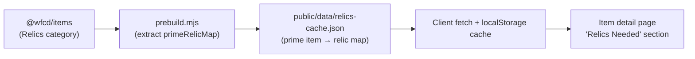

## Goal Capsule

- **Objective:** Show players which Void Relics contain the components needed to craft a prime item, directly on the item detail page.
- **Product authority:** Player need expressed in issue #29 — when tracking a prime item, the natural next question is "which relics do I run?"
- **Open blockers:** Verify that `@wfcd/items` relic objects expose vaulted status and reward rarity tier before prebuild work begins.

---

## Product Contract

### Summary

Add a "Relics Needed" section to the item detail page that maps each prime item to the relics dropping its components. The section shows relic names, vaulted status as a muted badge, and reward rarity tier per relic-part pair. Relic data is prebuilt from `@wfcd/items` into a new `public/data/relics-cache.json`, keeping it isolated from the core item cache.

### Problem Frame

The item detail page currently surfaces crafting dependencies — raw materials, sub-components, and their quantities — but stops short of telling players where to obtain prime parts. Prime parts are exclusive Void Relic rewards, and the app has no relic awareness at all. `@wfcd/items` ships 3,096 relics with complete reward tables, vaulting status, and rarity tiers, but prebuild skips the Relics category entirely and none of that data reaches the client. Players farming a prime item must leave the app to look up relic drops, breaking the planning loop the tracker is supposed to support.

### Requirements

**Data model and prebuild**

- R1. Prebuild extracts the Relics category from `@wfcd/items` and writes a derived `primeRelicMap` into `public/data/relics-cache.json`. Each entry maps a prime item ID to the relics that drop its components, including the component name, reward rarity tier, and vaulted status per relic.
- R2. `relics-cache.json` is versioned alongside `wfcd-cache.json` so the client can invalidate its localStorage cache when the underlying `@wfcd/items` package version changes.
- R3. The prebuild output includes only the derived mapping, not the full raw Relics category payload. The mapping is the minimum structure needed by the item detail section.

**Item detail section**

- R4. The item detail page renders a "Relics Needed" section for prime items. The section lists each relic once per component it drops for that item.
- R5. Each relic entry shows the relic name, the component it drops (e.g., Neuroptics, Chassis, Systems), and the reward rarity tier (Common, Uncommon, Rare).
- R6. Vaulted relics display a muted badge. Unvaulted relics display without the badge.
- R7. Non-prime items do not render the "Relics Needed" section. The section is gated by prime-item detection.

**Client loading and caching**

- R8. The client fetches `relics-cache.json` on demand and caches it in localStorage keyed by the `@wfcd/items` package version, matching the existing `wfcd-cache.json` pattern.
- R9. If `relics-cache.json` is missing or fails to load, the "Relics Needed" section degrades to an empty state without breaking the rest of the item detail page.

### Key Decisions

- **Separate `relics-cache.json` over extending `wfcd-cache.json`.** Relic data has a different lifecycle and growth trajectory than core item data. Keeping it isolated lets the cache grow (drop rates, refinement tables, farming routes) without schema migrations to the core cache.
- **Include reward rarity tier alongside vaulted status.** Rarity tier is already present in the source data and costs one extra field per relic-part pair in the UI. It turns the section from a passive reference into a farming-priority signal.
- **Muted badge for vaulted status.** Vaulted relics remain findable but visually de-emphasized. This keeps the list scannable without hiding information the player may need for trading or event anticipation.

### Actors

- A1. **Player** — the sole actor. Navigates to an item detail page, reads the "Relics Needed" section to decide which relics to farm.

### Key Flows

- F1. Player views a prime item detail page
  - **Trigger:** Player navigates to or searches for a prime item.
  - **Actors:** A1.
  - **Steps:** The item detail page detects the item is prime. It loads `relics-cache.json` from the client cache (or fetches it if uncached). It looks up the prime item's ID in the `primeRelicMap` and renders the "Relics Needed" section with each matched relic, component, rarity, and vaulted badge.
  - **Outcome:** The player sees a complete list of relics to run for that prime item, with enough context to prioritize farming.

### Scope Boundaries

**Deferred for later**

- Full relic catalog and relic detail pages
- Drop rates, expected-run calculations, and refinement tables
- Farming route recommendations ("best relic to crack right now")
- Market pricing integration (ducat, platinum values via warframe.market)
- Integration with item tracking state (no "I'm tracking this part → highlight relevant relics" behavior)

**Outside this product's identity**

- Relic inventory management (tracking which relics the player owns)
- Vaulted/unvaulted event calendars or notifications

### Dependencies / Assumptions

- `@wfcd/items` relic objects expose a `vaulted` boolean and per-reward `rarity` tier. If vaulted status is unavailable, the feature degrades to showing rarity tier only and vaulted status is added in a follow-up.
- The item detail page component structure supports adding a new card/section without disrupting the existing Crafting Tree card.

### Outstanding Questions

- **Resolve before planning:** Confirm the exact field names and structure of `@wfcd/items` relic objects so the prebuild extraction logic can be written without guesswork.
